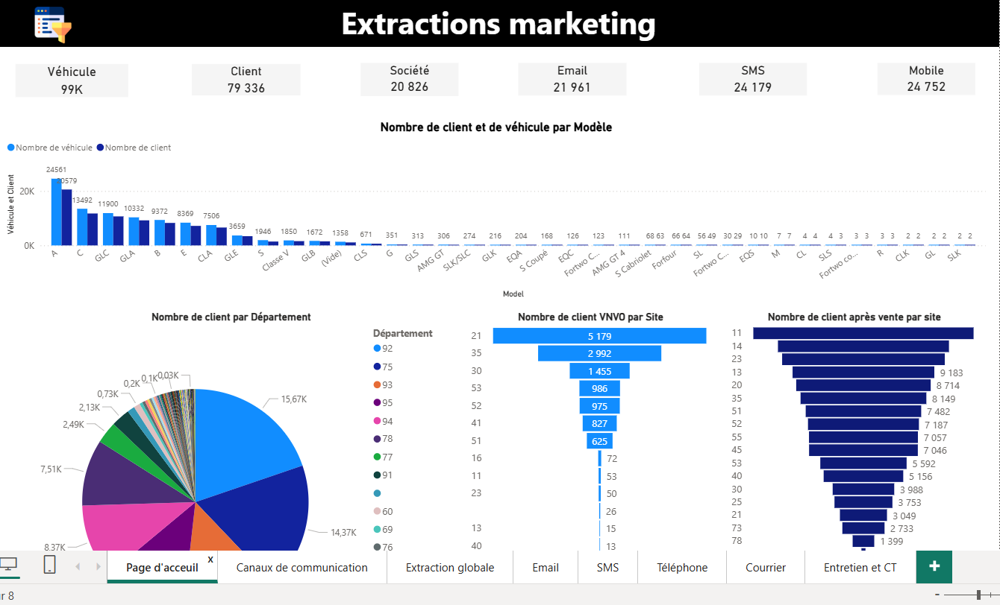
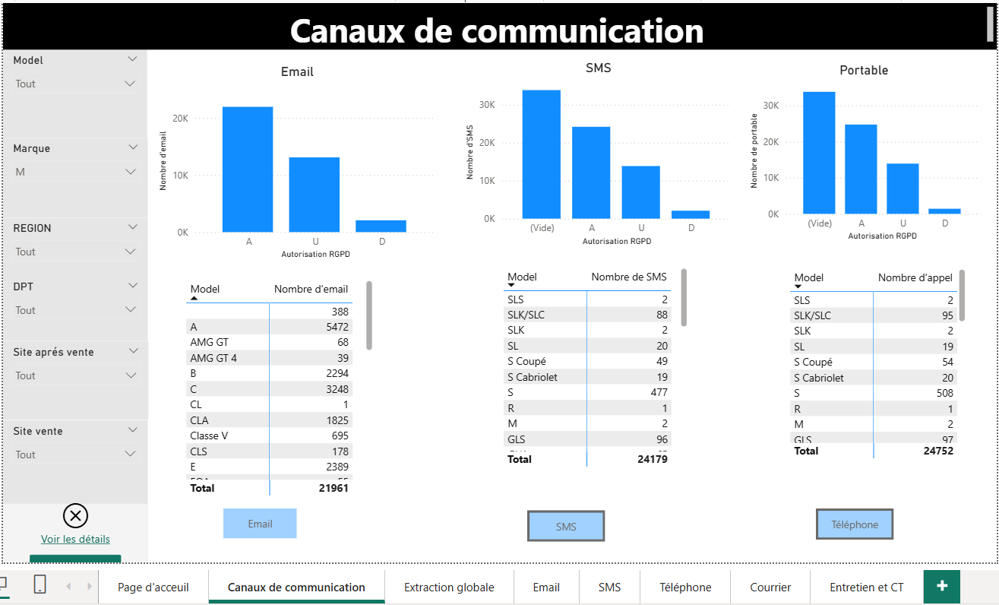
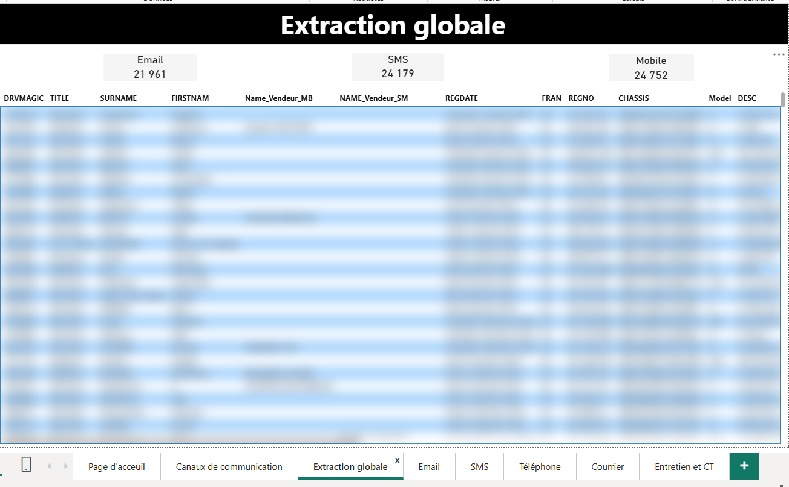
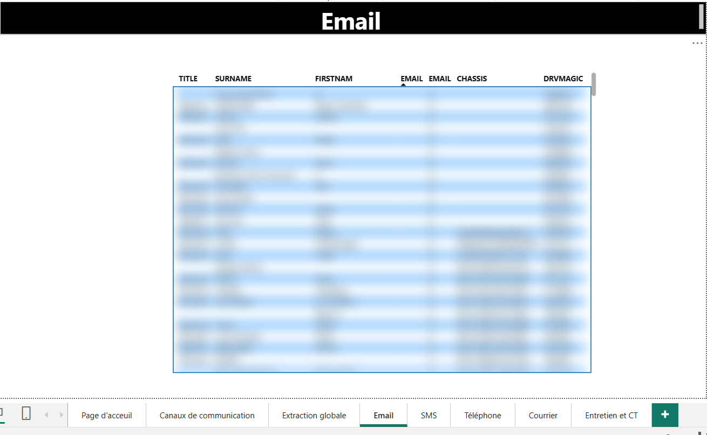
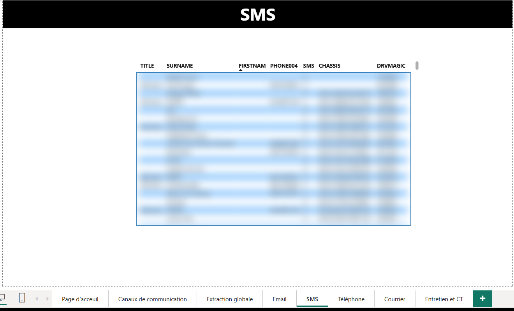
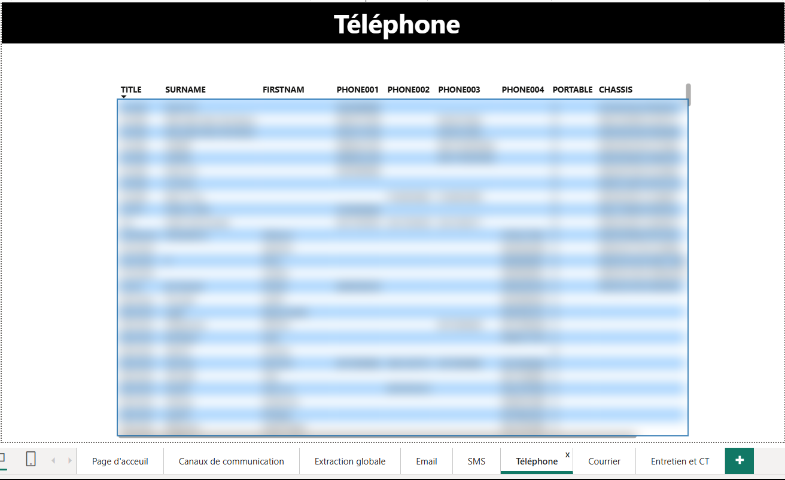
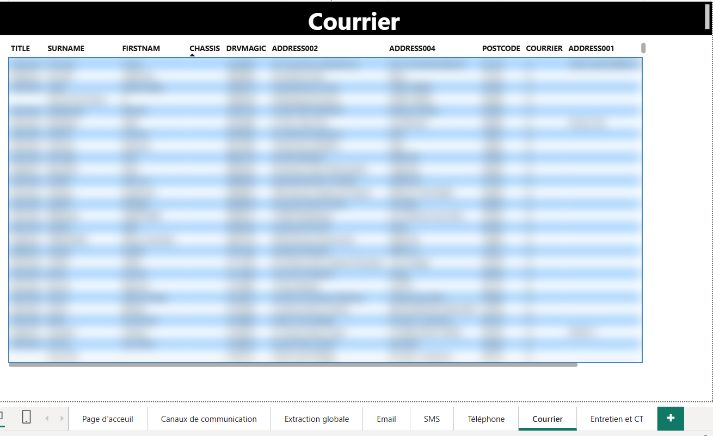
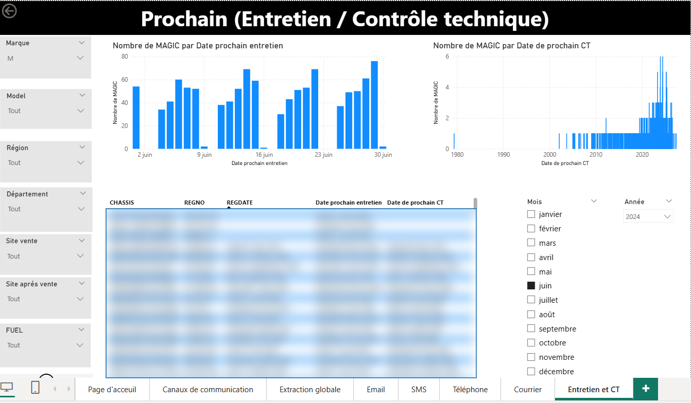

# Analyse des extractions marketing multicanales

## Contexte

Dans le cadre de mon alternance en tant que Data Analyst, j’ai travaillé sur un projet d’analyse des extractions marketing destinées aux campagnes de communication client.

L’objectif était de permettre aux équipes marketing d’identifier les volumes disponibles par canal de communication, modèle de véhicule, site, département et type de contact afin d’optimiser le ciblage des campagnes.

## Problématique

Comment analyser et fiabiliser les populations clients et véhicules disponibles pour les campagnes marketing multicanales ?

## Objectifs du projet

- Suivre les volumes clients, véhicules et sociétés exploitables
- Analyser les canaux de communication disponibles : Email, SMS, Téléphone, Courrier
- Segmenter les clients par modèle, département, site et région
- Identifier les volumes disponibles pour les campagnes VN/VO et après-vente
- Faciliter les extractions marketing pour les équipes métier
- Préparer des vues détaillées par canal de contact

## Indicateurs clés

- Véhicules analysés : 99K
- Clients : 79 336
- Sociétés : 20 826
- Emails disponibles : 21 961
- SMS disponibles : 24 179
- Mobiles disponibles : 24 752

## Réalisations

- Création d’un dashboard Power BI de pilotage marketing
- Mise en place de filtres par modèle, marque, région, département et site
- Analyse des volumes par canal de communication
- Création de vues détaillées pour les extractions Email, SMS, Téléphone et Courrier
- Analyse des clients par modèle de véhicule
- Suivi des prochains entretiens et contrôles techniques
- Préparation de données exploitables pour les campagnes marketing

## Aperçu du dashboard

> Les données détaillées ont été floutées pour respecter la confidentialité. Les indicateurs globaux restent visibles afin d’illustrer la démarche d’analyse.

### Vue d'accueil

### Canaux de communication

### Extraction globale

### Extraction Email

### Extraction SMS

### Extraction Téléphone

### Extraction Courrier

### Suivi entretien et contrôle technique

## Compétences utilisées

- Power BI
- Power Query
- DAX
- SQL
- Analyse marketing
- Segmentation client
- Reporting
- Data visualization
- Nettoyage et préparation des données
- Analyse métier

## Résultats et impact

Ce dashboard a permis de centraliser l’analyse des populations marketing et de donner aux équipes une vision claire des volumes disponibles par canal de communication.

Il facilite la préparation des campagnes, le ciblage des clients et l’identification des contacts exploitables selon les critères métier.

## Confidentialité

Le fichier Power BI complet et les données sources ne sont pas partagés pour des raisons de confidentialité. Les captures présentées sont floutées lorsque des informations personnelles ou sensibles apparaissent.
