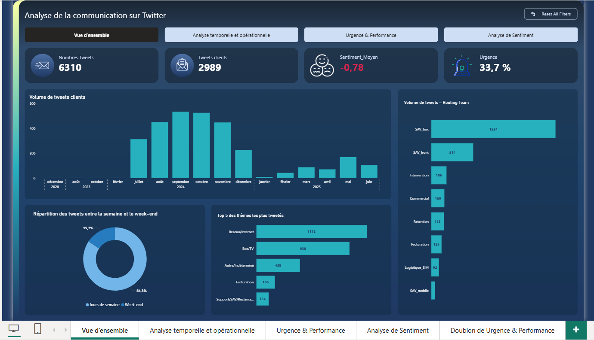
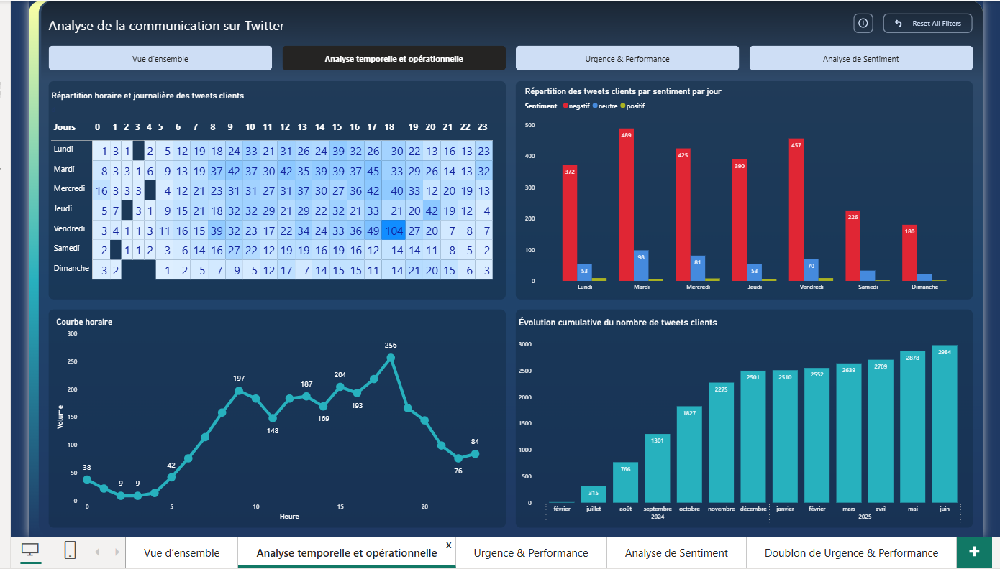
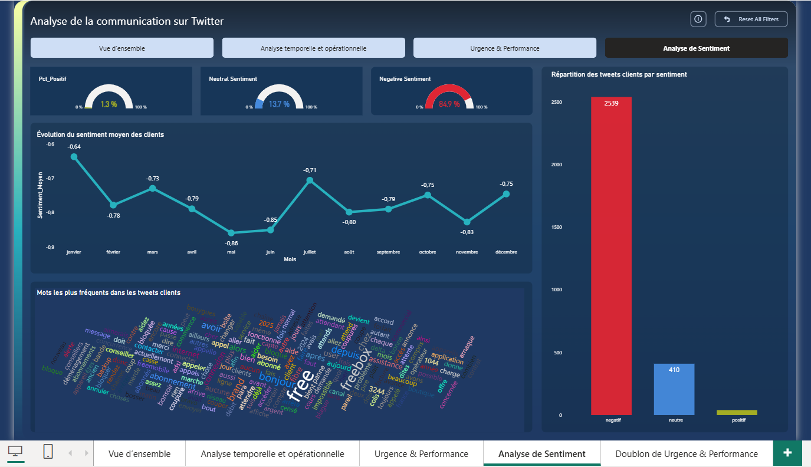
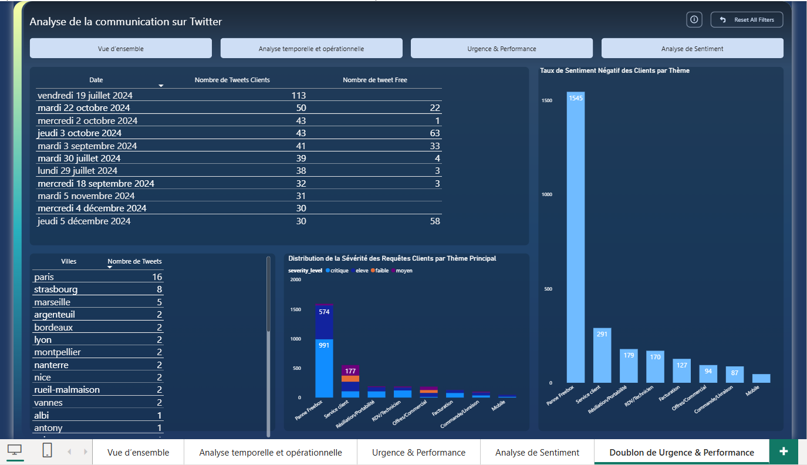

# Analyse de la communication client sur Twitter avec NLP, LLM et Power BI

## Contexte

Dans le cadre de mon projet de fin d’études, j’ai travaillé sur l’analyse automatique de tweets clients liés au service après-vente.

Les réseaux sociaux sont devenus un canal important d’expression client. Les utilisateurs y partagent leurs réclamations, frustrations, demandes d’aide ou retours d’expérience. L’objectif du projet était d’exploiter ces messages afin de mieux comprendre les irritants clients, détecter les demandes urgentes et aider les équipes SAV à prioriser les actions.

## Problématique

Comment analyser automatiquement des tweets clients afin d’identifier les sujets de réclamation, mesurer le sentiment client et détecter les demandes urgentes à traiter en priorité ?

## Objectifs du projet

- Collecter et préparer des tweets clients
- Nettoyer les données textuelles pour l’analyse NLP
- Identifier les thèmes récurrents des réclamations
- Analyser le sentiment des messages : négatif, neutre, positif
- Détecter les tweets urgents
- Analyser les volumes dans le temps
- Suivre les délais et niveaux de sévérité
- Construire un dashboard Power BI de pilotage
- Préparer une base exploitable pour une approche LLM/RAG

## Données analysées

Le projet s’appuie sur un jeu de données de tweets clients nettoyés et enrichis avec plusieurs variables d’analyse :

- Date du tweet
- Texte du tweet
- Thème principal
- Sentiment
- Niveau d’urgence
- Niveau de sévérité
- Routing team
- Ville détectée
- Indicateurs temporels
- Statut de traitement

## Indicateurs clés

- Nombre total de tweets analysés : 6 310
- Tweets clients identifiés : 2 989
- Sentiment moyen : -0,78
- Taux d’urgence : 33,7 %
- Répartition des tweets par sentiment
- Volume de tweets par mois
- Volume par routing team
- Répartition par niveau de sévérité
- Analyse des thèmes les plus fréquents
- Suivi des délais de traitement

## Méthodologie

### 1. Préparation des données

Les tweets ont été nettoyés afin de supprimer les éléments inutiles pour l’analyse :

- caractères spéciaux
- liens
- mentions
- doublons
- textes incomplets
- valeurs manquantes

### 2. Analyse NLP

Une analyse textuelle a été réalisée pour extraire les informations utiles :

- détection des thèmes principaux
- analyse de sentiment
- classification des demandes
- identification des messages urgents
- extraction des mots fréquents

### 3. Scoring et enrichissement

Les tweets ont ensuite été enrichis avec des indicateurs permettant une lecture métier :

- score de sentiment
- indicateur d’urgence
- niveau de sévérité
- catégorie de réclamation
- équipe de routage

### 4. Visualisation Power BI

Un dashboard interactif a été construit pour suivre les indicateurs clés et faciliter l’analyse par les équipes métier.

## Aperçu du dashboard

### Vue d’ensemble

### Analyse temporelle et opérationnelle

### Urgence et performance

### Analyse de sentiment

### Doublon urgence et performance

## Compétences utilisées

- Python
- Pandas
- NLP
- Analyse de sentiment
- Classification de texte
- Power BI
- DAX
- Power Query
- Data visualization
- Analyse métier
- Reporting SAV
- LLM / RAG

## Résultats et impact

Ce projet permet de transformer des tweets clients non structurés en indicateurs exploitables pour le pilotage du service après-vente.

Le dashboard aide à identifier les pics de réclamations, les thèmes les plus fréquents, les messages urgents et les niveaux de sentiment négatif. Il permet également de mieux comprendre les irritants clients et de prioriser les demandes à fort impact.

## Améliorations possibles

- Ajouter un chatbot permettant d’interroger les tweets en langage naturel
- Connecter le dashboard à une source de données actualisée automatiquement
- Améliorer la classification des thèmes avec un modèle NLP plus avancé
- Ajouter un suivi des réponses apportées aux clients
- Mesurer l’évolution du sentiment avant et après traitement
- Déployer une API de scoring automatique des nouveaux tweets

