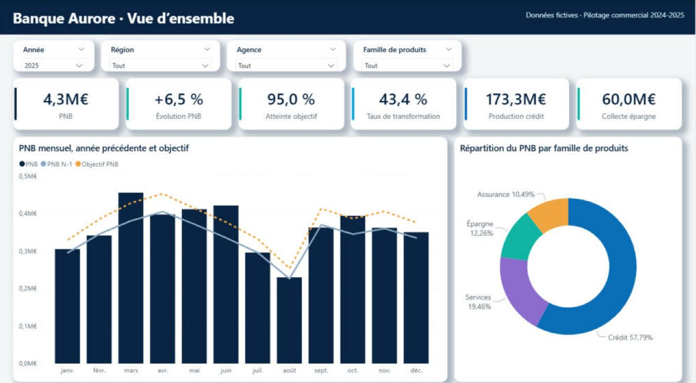
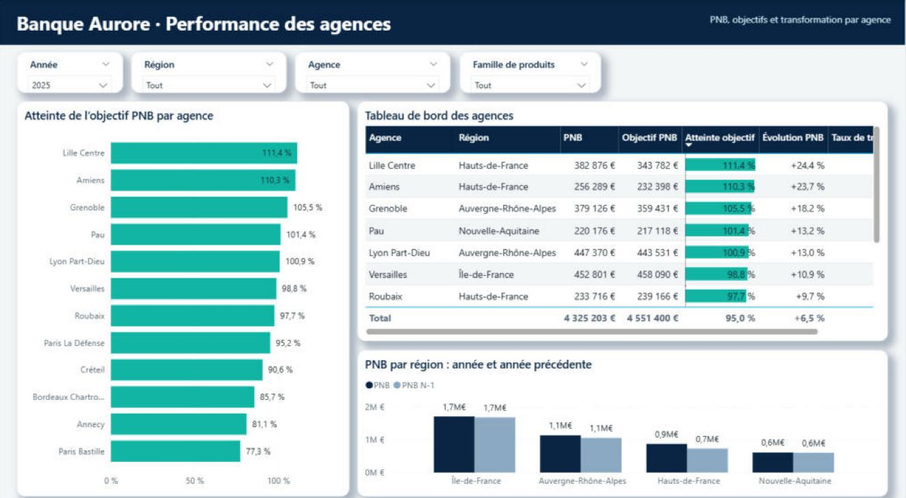
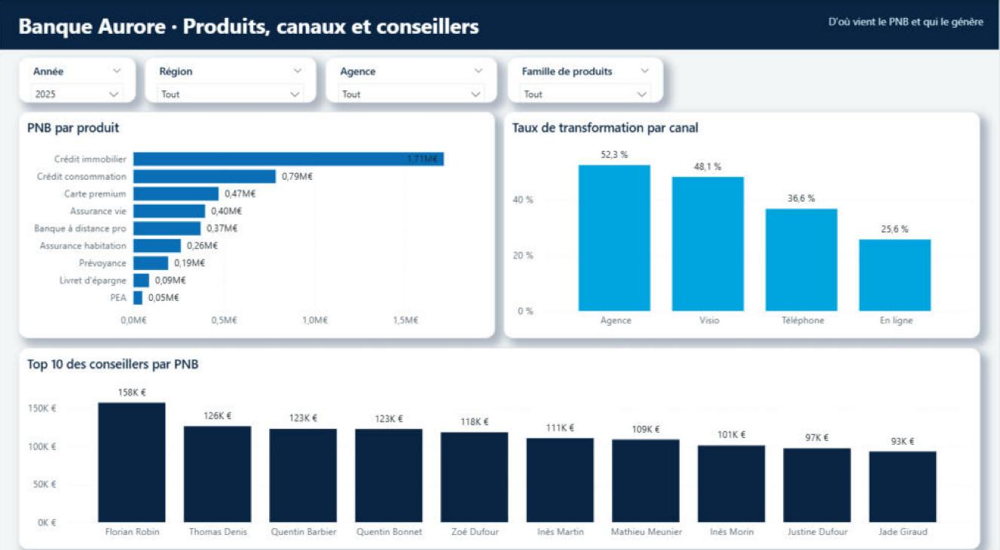
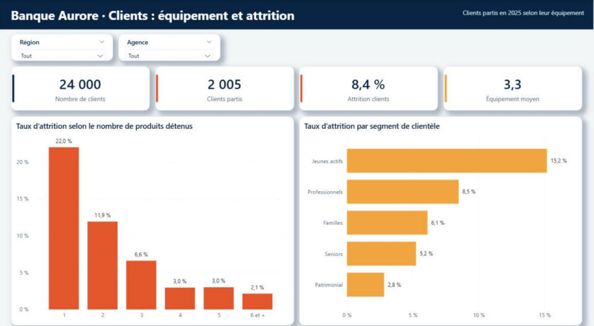

# Pilotage de la performance commerciale d’un réseau bancaire

## Contexte

Projet personnel réalisé sur une banque de détail fictive, **Banque Aurore**, avec des données que j’ai entièrement générées en Python : 12 agences réparties dans 4 régions, 63 conseillers, 24 000 clients et 62 184 opportunités commerciales sur 2024 et 2025.

L’objectif est de reproduire le travail d’un Data Analyst dans la direction commerciale d’un réseau bancaire : construire le modèle de données, définir les indicateurs qui comptent pour la direction, puis livrer un rapport Power BI qui dit clairement où le réseau gagne et où il perd.

## Problématique

Le réseau atteint-il ses objectifs de PNB, quelles agences et quels canaux tirent la performance, et comment réduire le départ des clients ?

## Résultats clés (2025)

- **4,33 M€** de PNB, en hausse de **6,5 %** sur un an, mais **95,0 %** seulement de l’objectif (4,55 M€) : il manque 226 k€
- **5 agences sur 12** atteignent leur objectif, de **111,4 %** (Lille Centre) à **77,3 %** (Paris Bastille) ; 3 agences reculent sur un an, dont Paris Bastille (-13,4 %)
- **43,4 %** des opportunités se transforment en vente (+0,8 point), avec **14 044** ventes signées (+10,6 %)
- **173,3 M€** de crédits produits et **60,0 M€** d’épargne collectée ; le crédit pèse **58 %** du PNB
- Le rendez-vous en agence transforme **52,3 %** des opportunités, contre **25,6 %** en ligne, alors que la part du digital passe de **26,1 %** à **35,3 %**
- **8,4 %** des clients sont partis en 2025 : **15,4 %** chez les clients qui ont 1 ou 2 produits, contre **2,8 %** à partir de 4 produits, soit un risque **5,6 fois** plus élevé

## Démarche

### 1. Génération d’un jeu de données réaliste

Un script Python ([generer_donnees.py](scripts/generer_donnees.py)) crée six tables cohérentes entre elles, avec une graine fixe pour que les résultats soient reproductibles :

| Table | Lignes | Contenu |
|---|---|---|
| `opportunites` | 62 184 | date, agence, conseiller, client, produit, canal, statut (signé / perdu), montant, PNB |
| `clients` | 24 000 | segment, âge, ancienneté, nombre de produits détenus, départ en 2025 |
| `objectifs` | 576 | objectif de PNB 2025 par mois, agence et famille de produits |
| `conseillers` | 63 | agence, fonction, ancienneté |
| `agences` | 12 | agence, région |
| `produits` | 9 | produit, famille (Crédit, Épargne, Assurance, Services), taux de PNB |

Les données suivent des comportements réalistes : saisonnalité (creux d’août, pic du crédit immobilier au printemps), montée du digital entre 2024 et 2025, affinité des produits selon le segment, écarts de performance entre agences et conseillers, et attrition plus forte chez les clients peu équipés.

### 2. Modélisation

Modèle en étoile dans Power BI : la table des opportunités au centre, reliée aux agences, conseillers, produits et à une table calendrier ; les objectifs et les clients sont reliés aux agences.

### 3. Indicateurs DAX

| Indicateur | Définition |
|---|---|
| PNB | somme du PNB des ventes signées |
| Évolution PNB | PNB vs même période de l’année précédente (`SAMEPERIODLASTYEAR`) |
| Atteinte objectif | PNB / objectif de PNB |
| Taux de transformation | ventes signées / opportunités traitées |
| Production crédit, collecte épargne | montants signés sur les familles Crédit et Épargne |
| Attrition clients | clients partis / nombre de clients |
| Équipement moyen | nombre moyen de produits détenus par client |

### 4. Restitution

Un **rapport Power BI de 4 pages** (vue d’ensemble, agences, produits et conseillers, clients), filtrable par année, région, agence et famille de produits.

## Aperçu du rapport Power BI

Le rapport compte 4 pages, filtrables par année, région, agence et famille de produits.

### Vue d’ensemble

Les six indicateurs clés de l’année, le PNB mois par mois comparé à l’année précédente et à l’objectif, et la répartition du PNB par famille de produits.

### Performance des agences

L’atteinte de l’objectif par agence, un tableau de bord avec barres de données (PNB, objectif, atteinte, évolution, transformation) et le PNB par région comparé à l’année précédente.

### Produits, canaux et conseillers

Le PNB par produit, le taux de transformation par canal de contact et le top 10 des conseillers.

### Clients : équipement et attrition

Le taux d’attrition selon le nombre de produits détenus et par segment de clientèle.

## Recommandations

- **Agences sous 90 % de l’objectif** (Paris Bastille, Annecy, Bordeaux Chartrons) : revoir avec elles le portefeuille d’opportunités et la répartition des objectifs, en priorité Paris Bastille, dont le PNB recule de 13,4 % alors que son objectif prévoyait une hausse.
- **Canaux digitaux** : ils apportent du volume mais transforment deux fois moins qu’un rendez-vous en agence. Proposer un rendez-vous visio ou agence aux demandes en ligne les plus avancées.
- **Multi-détention** : faire passer les clients de 1-2 produits à 3 produits et plus, en ciblant d’abord les jeunes actifs, le segment le moins équipé et celui qui part le plus (15 %).
- **Conseillers** : l’écart de PNB entre conseillers va de 1 à 6,7 ; partager les pratiques des meilleurs.

## Compétences utilisées

- Python : génération et préparation de données (Pandas, NumPy)
- Power BI : modélisation en étoile, DAX (time intelligence), Power Query, mise en forme
- Définition de KPI commerciaux bancaires : PNB, objectifs, transformation, équipement, attrition
- Data visualization et reporting décisionnel
- Analyse et recommandations métier

## Fichiers du projet

- [`scripts/generer_donnees.py`](scripts/generer_donnees.py) : génération du jeu de données fictif
- [`scripts/generer_pbip.py`](scripts/generer_pbip.py) : modèle Power BI (tables, relations, mesures DAX) et pages du rapport
- [`data/`](data/) : les six tables au format CSV

> Toutes les données sont fictives : aucune banque, aucun client et aucun conseiller réels ne sont représentés.
