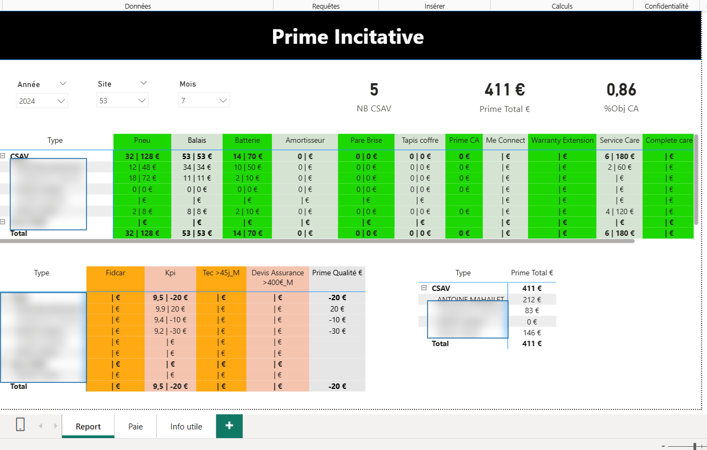
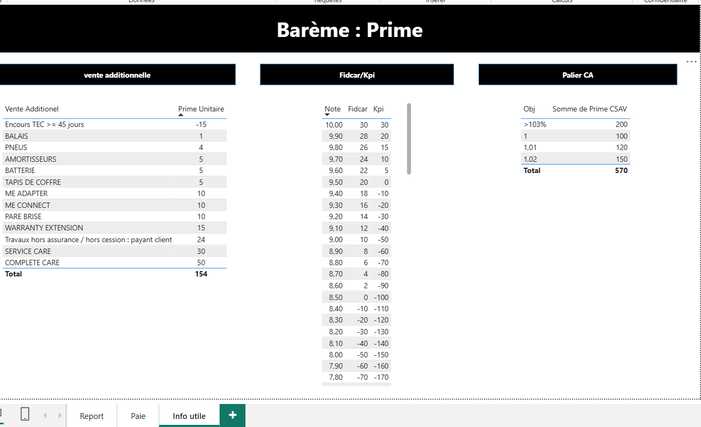

# Automatisation du calcul et du suivi des primes CSAV

## Contexte

Dans le cadre de mon alternance en tant que Data Analyst, j’ai travaillé sur un prototype de dashboard Power BI destiné au suivi des primes incitatives des conseillers CSAV.

L’objectif était de centraliser les règles de calcul, automatiser le suivi des primes et fournir une vision claire des montants par collaborateur, site, mois et type d’activité.

## Problématique

Comment fiabiliser le calcul des primes CSAV et donner aux équipes une vue synthétique des montants à contrôler avant validation ?

## Objectifs du projet

- Centraliser les règles de calcul des primes
- Suivre les primes par CSAV, site, mois et année
- Visualiser les montants par catégorie de vente additionnelle
- Intégrer les règles de bonus/malus liées aux KPI
- Préparer une vue exploitable pour le contrôle paie
- Réduire les calculs manuels et les risques d’erreur

## Indicateurs clés

- Nombre de CSAV suivis
- Prime totale en euros
- Pourcentage d’objectif chiffre d’affaires
- Montant par type de prime : pneus, balais, batterie, amortisseur, pare-brise, tapis coffre, service care, complete care
- Bonus/malus selon KPI
- Synthèse de prime par collaborateur

## Réalisations

- Création d’un dashboard Power BI de suivi des primes
- Construction d’un barème de calcul par type de vente additionnelle
- Mise en place de filtres par année, mois et site
- Création d’une synthèse par CSAV
- Séparation entre primes liées aux ventes additionnelles et ajustements liés aux KPI
- Préparation d’une vue de contrôle pour faciliter la validation des montants
- Mise en forme conditionnelle pour distinguer rapidement les catégories de primes

## Aperçu du dashboard

> Les noms des collaborateurs ont été floutés pour respecter la confidentialité. Les indicateurs globaux restent visibles afin d’illustrer la logique de calcul.

### Suivi des primes incitatives

### Barème de calcul des primes

## Logique métier du calcul

Le calcul des primes repose sur plusieurs familles de règles :

- Primes unitaires liées aux ventes additionnelles
- Bonus/malus selon la note KPI
- Paliers liés à l’atteinte de l’objectif de chiffre d’affaires
- Consolidation mensuelle par CSAV
- Totalisation des montants pour contrôle avant transmission

## Compétences utilisées

- Power BI
- DAX
- Power Query
- Excel
- Modélisation de règles métier
- Création de KPI
- Reporting financier
- Automatisation de calculs
- Data visualization
- Analyse opérationnelle

## Résultats et impact

Ce projet permet de structurer le suivi des primes CSAV dans un dashboard unique, avec une lecture claire des montants calculés et des règles appliquées.

Il contribue à réduire les contrôles manuels, fiabiliser les calculs et faciliter la communication entre les équipes opérationnelles et les équipes de validation.

## Améliorations possibles

- Ajouter une page détaillée par collaborateur
- Ajouter un historique mensuel des primes
- Comparer les primes par site et par période
- Mettre en place des alertes en cas d’écart ou de montant anormal
- Automatiser l’export d’un fichier de contrôle pour la paie
- Connecter le dashboard à une source de données actualisée automatiquement

## Confidentialité

Le fichier Power BI complet et les données sources ne sont pas partagés pour des raisons de confidentialité. Les captures présentées servent à illustrer la structure du dashboard, les indicateurs suivis et la logique de calcul.
