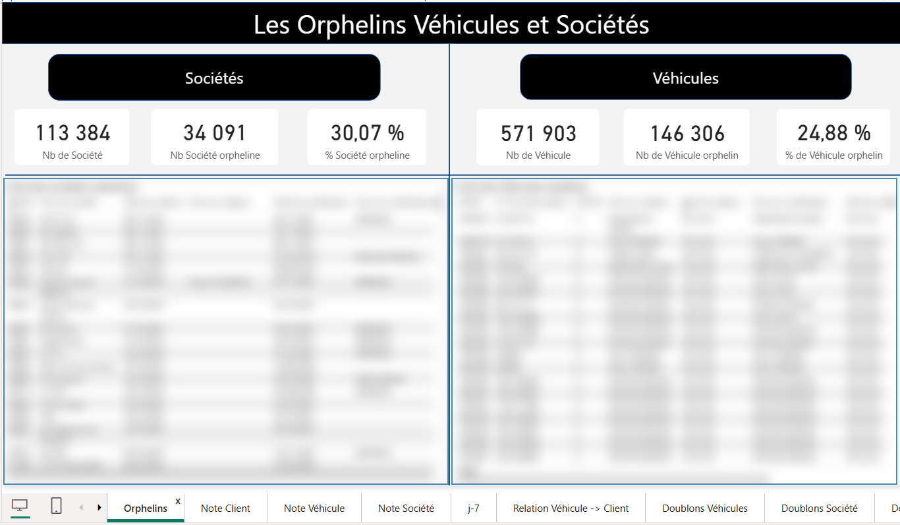
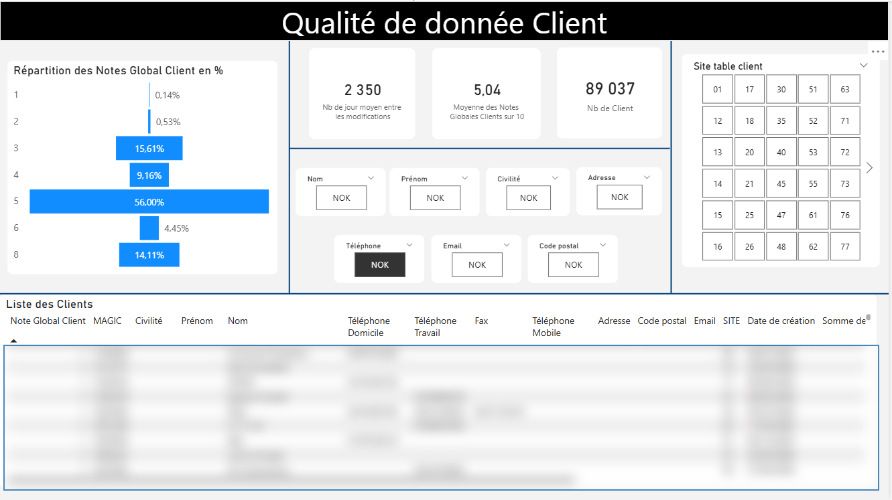
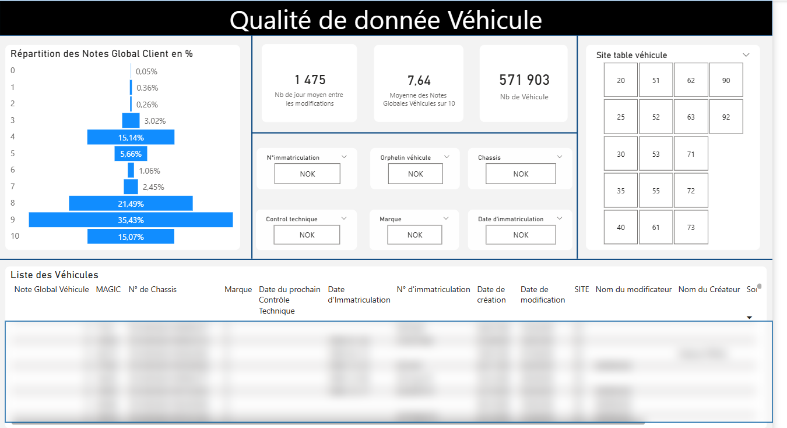
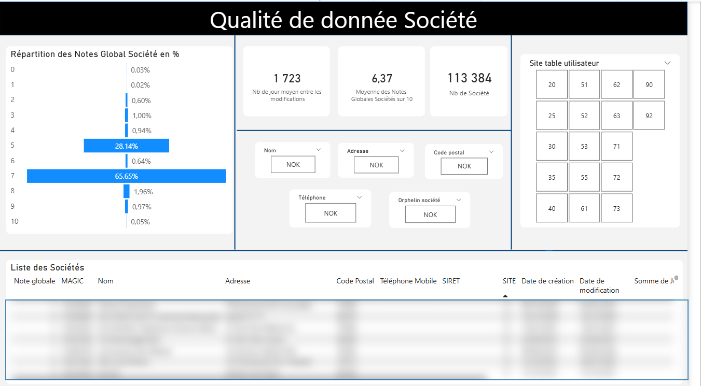

# Pilotage de la qualité des données clients, véhicules et sociétés

## Contexte

Dans le cadre de mon alternance en tant que Data Analyst, j’ai travaillé sur un projet de suivi de la qualité des données référentielles autour de trois périmètres métier : clients, véhicules et sociétés.

L’objectif était de permettre aux équipes métier d’identifier rapidement les anomalies présentes dans les bases de données, comme les champs manquants, les incohérences, les doublons ou les enregistrements orphelins.

## Problématique

Comment mesurer la qualité des données référentielles et aider les équipes métier à prioriser les corrections à effectuer ?

## Objectifs du projet

- Suivre la qualité des données clients, véhicules et sociétés
- Identifier les données manquantes ou non conformes
- Détecter les véhicules et sociétés orphelins
- Mettre en place des scores qualité par référentiel
- Visualiser les anomalies par site et par type de donnée
- Faciliter la priorisation des corrections métier

## Données analysées

Le projet s’appuie sur plusieurs référentiels métier :

- Données clients
- Données véhicules
- Données sociétés
- Relations entre véhicules, clients et sociétés
- Données de sites
- Données de création et de modification

## Indicateurs clés

- Nombre total de clients : 89 037
- Nombre total de véhicules : 571 903
- Nombre total de sociétés : 113 384
- Véhicules orphelins : 146 306, soit 24,88 %
- Sociétés orphelines : 34 091, soit 30,07 %
- Score qualité moyen client : 5,04 / 10
- Score qualité moyen véhicule : 7,64 / 10
- Score qualité moyen société : 6,37 / 10

## Réalisations

- Analyse des référentiels clients, véhicules et sociétés
- Définition de règles de contrôle qualité par champ métier
- Création d’indicateurs de complétude et de conformité
- Identification des données orphelines
- Mise en place de filtres par site
- Création de dashboards Power BI interactifs
- Construction de vues détaillées pour faciliter les corrections

## Aperçu du dashboard

### Vue globale des orphelins

Les données détaillées ont été floutées pour respecter la confidentialité. Les indicateurs globaux restent visibles afin d’illustrer la démarche d’analyse.

### Qualité de donnée client

### Qualité de donnée véhicule

### Qualité de donnée société

## Compétences utilisées

- Power BI
- DAX
- Power Query
- SQL
- Data Quality
- Data Cleaning
- Data Visualization
- Analyse métier
- Création de KPI
- Reporting décisionnel

## Résultats et impact

Ce dashboard a permis de centraliser le suivi de la qualité des données et de donner aux équipes métier une vision claire des anomalies à traiter.

Il facilite l’identification des données critiques, la priorisation des corrections et le suivi de la fiabilité des référentiels dans le temps.

## Améliorations possibles

- Ajouter un suivi de l’évolution des anomalies dans le temps
- Mettre en place des alertes automatiques sur les seuils critiques
- Créer un score qualité global par site
- Automatiser l’actualisation des données
- Ajouter une documentation des règles de contrôle qualité

## Pour des raisons de confidentialité, le fichier Power BI complet et les données sources ne sont pas partagés. Les captures présentées ont pour objectif d’illustrer la structure du dashboard, les indicateurs suivis et la démarche d’analyse.
