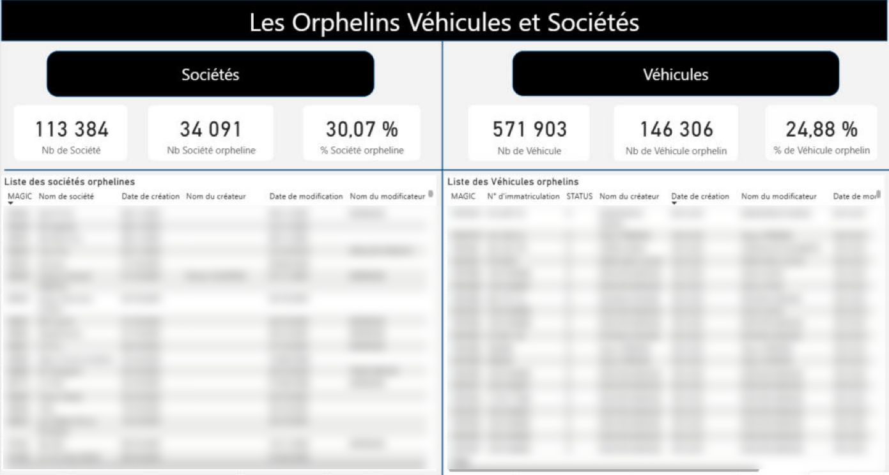
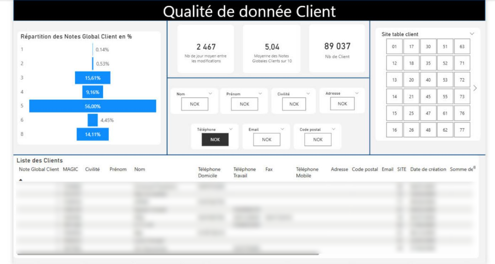
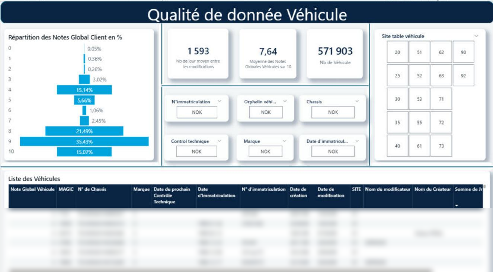
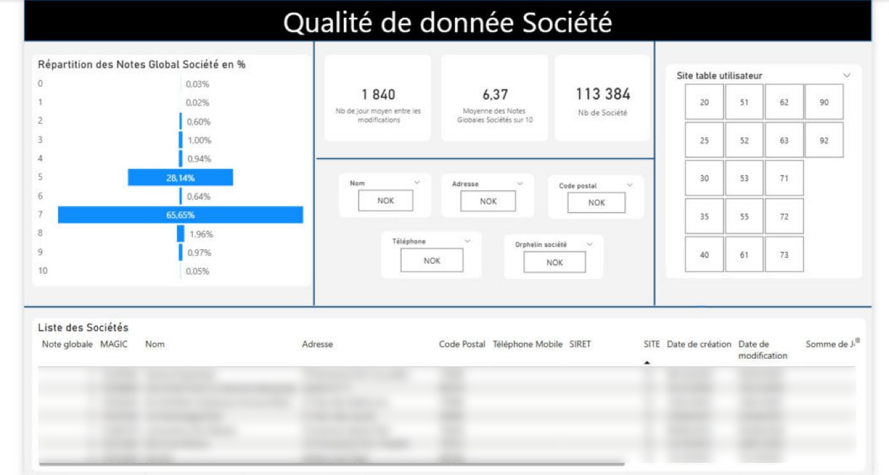
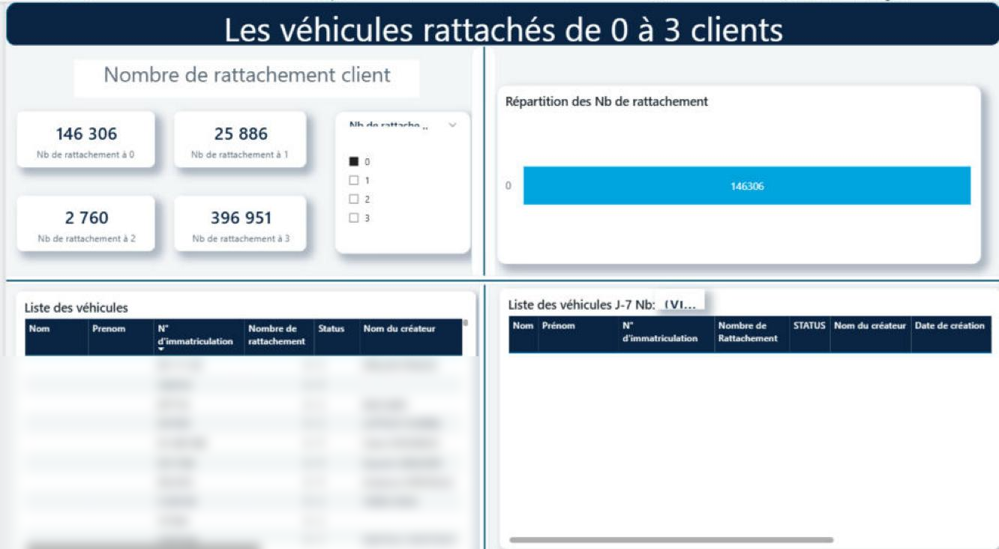
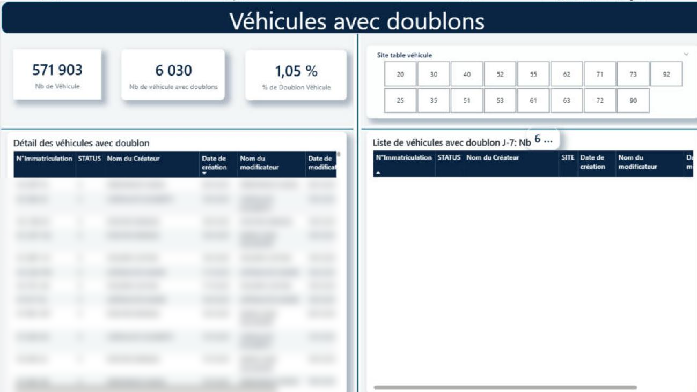
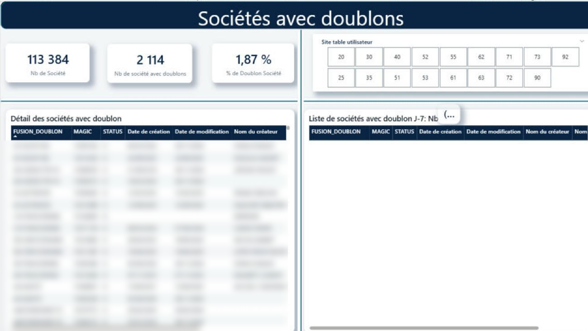
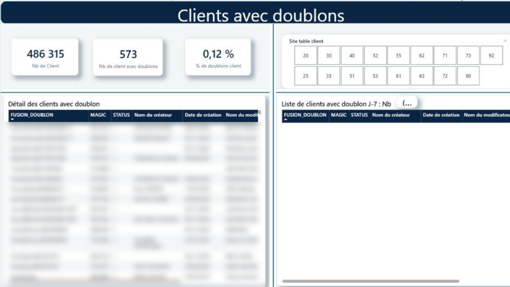
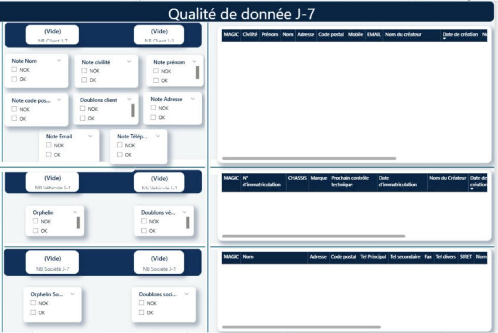
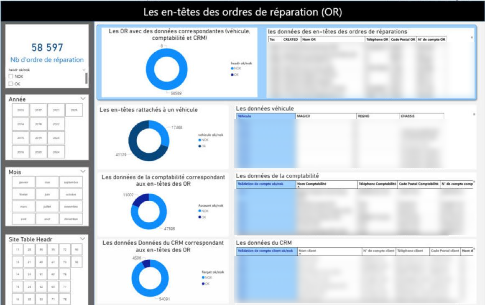

# Pilotage de la qualité des données clients, véhicules et sociétés

## Contexte

Chez Mercedes-Benz France, j’ai conçu un dashboard Power BI de suivi de la qualité des données référentielles du réseau après-vente : clients, véhicules, sociétés et ordres de réparation.

Ces bases alimentent le CRM, la facturation et les campagnes marketing. Des fiches incomplètes, en double ou sans rattachement faussent les relances clients, les ciblages et le suivi d’activité. L’objectif était de mesurer ces anomalies, de les localiser par site et de donner aux équipes métier une liste concrète des fiches à corriger.

## Problématique

Comment mesurer la qualité de plusieurs référentiels volumineux et aider les équipes métier à prioriser les corrections ?

## Résultats clés

- **89 037** clients, **571 903** véhicules et **113 384** sociétés audités
- **146 306** véhicules orphelins, soit **24,88 %**, sans aucun client rattaché
- **34 091** sociétés orphelines, soit **30,07 %**
- **6 030** véhicules en double (1,05 %), **2 114** sociétés en double (1,87 %) et **573** clients en double
- Notes qualité moyennes : **5,04 / 10** pour les clients, **7,64 / 10** pour les véhicules, **6,37 / 10** pour les sociétés
- **58 597** ordres de réparation contrôlés sur leur cohérence avec les véhicules, la comptabilité et le CRM

## Démarche

### 1. Définition des règles de contrôle

Pour chaque référentiel, j’ai défini avec les équipes métier les champs critiques et la règle qui les rend conformes (OK) ou non conformes (NOK) :

| Référentiel | Champs contrôlés |
|---|---|
| Client | Nom, prénom, civilité, adresse, code postal, téléphone, email |
| Véhicule | Immatriculation, châssis, marque, date d’immatriculation, contrôle technique, rattachement à un client |
| Société | Nom, adresse, code postal, téléphone, rattachement |

### 2. Calcul d’une note qualité par fiche

Chaque fiche reçoit une note globale sur 10, calculée en DAX à partir du nombre de champs conformes. Cette note permet de comparer les référentiels entre eux et de trier les fiches de la plus dégradée à la plus complète.

### 3. Détection des orphelins et des doublons

- **Orphelins** : véhicules sans client rattaché, sociétés sans lien actif
- **Doublons** : construction d’une clé de rapprochement (nom + téléphone pour les clients, nom + code postal pour les sociétés, immatriculation pour les véhicules) pour repérer les fiches créées plusieurs fois
- **Rattachements** : comptage du nombre de clients liés à chaque véhicule (de 0 à 3)

### 4. Suivi dans le temps et par site

- Filtres par site sur toutes les pages, pour que chaque concession voie ses propres anomalies
- Page **J-7** qui isole les fiches créées ou modifiées dans les 7 derniers jours, pour corriger les erreurs dès leur saisie
- Délai moyen entre deux modifications d’une fiche, pour repérer les données qui ne sont plus mises à jour

### 5. Restitution Power BI

Un rapport de 10 pages, avec des indicateurs en haut et la liste détaillée des fiches à corriger en bas, exportable par les équipes.

## Aperçu du dashboard

Les données nominatives (noms, immatriculations, téléphones, sociétés) ont été floutées pour respecter la confidentialité. Les indicateurs globaux restent visibles.

### Véhicules et sociétés orphelins

### Qualité des données clients

### Qualité des données véhicules

### Qualité des données sociétés

### Rattachement des véhicules aux clients

### Doublons véhicules

### Doublons sociétés

### Doublons clients

### Suivi des nouvelles saisies (J-7)

### Cohérence des ordres de réparation

Contrôle des 58 597 en-têtes d’ordres de réparation : sont-ils bien reliés à un véhicule, à un compte comptable et à un client du CRM ?

## Compétences utilisées

- Power BI : DAX, Power Query, modélisation
- Azure Data Factory
- Data quality : règles de contrôle, complétude, doublons, orphelins
- Définition de KPI avec les équipes métier
- Data visualization et reporting décisionnel

## Résultats et impact

- Une vision unique et chiffrée de la qualité des référentiels, partagée avec les équipes métier
- Des listes de fiches à corriger, filtrables par site, au lieu d’un constat global
- Une priorisation claire : un véhicule sur quatre sans client et près d’une société sur trois orpheline
- Un suivi J-7 pour corriger les erreurs dès la saisie plutôt qu’après coup

## Améliorations possibles

- Suivre l’évolution des notes qualité mois par mois
- Envoyer des alertes automatiques quand un site dépasse un seuil d’anomalies
- Calculer un score qualité global par site
- Documenter les règles de contrôle dans un dictionnaire de données

> Pour des raisons de confidentialité, le fichier Power BI et les données sources ne sont pas partagés.
